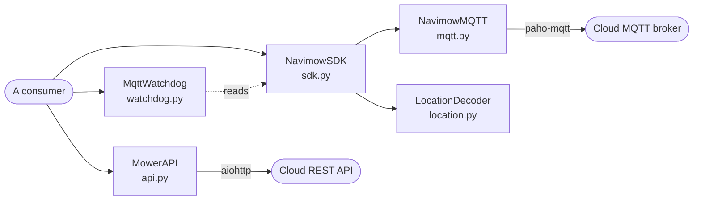
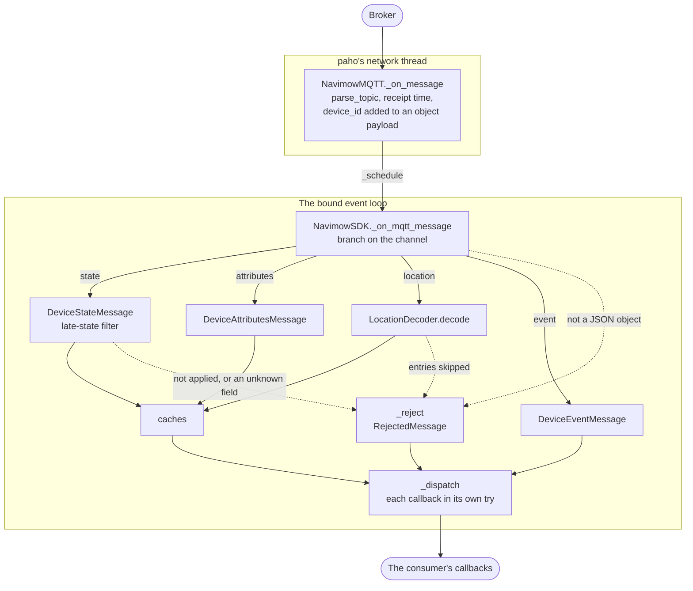

# Architecture

How the live path of `mower_sdk` fits together and why it is built the way it
is, for someone about to change it. The live path is the code new programs
use: `MowerAPI`, `NavimowSDK`, `NavimowMQTT`, `MqttWatchdog`, the models and
the errors. What a caller sees of it (defaults, hooks, how to use each piece)
is in the [README](../README.md#behaviour-notes); this document gives the
structure behind that and links there instead of repeating it. The
[development guide](development.md) lists the modules and the checks.

## The parts



The cloud is reached over two transports, and the two classes that do it do
not know each other.

- `MowerAPI` is the REST client: request and reply over an
  `aiohttp.ClientSession` the caller creates and closes. It lists the
  devices, reads their status, sends commands and queries their results, and
  fetches the MQTT connection information.
- `NavimowMQTT` is the feed. It owns a paho client, subscribes each device's
  `state`, `event` and `attributes` topics (and `location` when asked), and
  passes every message to async hooks. It builds no model.
- `NavimowSDK` is the facade over one `NavimowMQTT`, reachable as `sdk.mqtt`.
  It decodes payloads into the models, filters them, keeps the caches and
  calls the consumer's plain callbacks.

`models.py` and `errors.py` are shared by all three. The facade holds no REST
client, because the consumer owns the session and the OAuth token (see the
README's [quick example](../README.md#quick-example)). The transports meet in
two calls: `NavimowSDK.from_connection_info()` takes the `MqttConnectionInfo`
the API returned, and `async_refresh_broker_credentials(api, ...)` takes the
API as an argument.

## From a broker message to a callback



- **On paho's thread.** `parse_topic` reads the device id and the channel
  from `/downlink/vehicle/{device id}/realtimeDate/{channel}`; a topic that
  does not parse (an extra topic) reaches `on_raw` only. An object payload is
  re-encoded with `device_id` added, because
  `on_message(topic, bytes, device_id)` is the contract upstream published
  and callers decode the bytes themselves (the README's
  [MQTT notes](../README.md#mqtt) say what arrives).
- **Models.** The state, event and attributes models read the payload in
  `from_dict`; a channel the facade does not know is dropped. A raw state
  that `RAW_STATE_TO_CANONICAL` lacks passes through as sent (see the README's
  [mower states](../README.md#mower-states)).
- **State filter.** Only with `reject_late_state=True`. A timestamp before
  2020 or more than five minutes after receipt is `implausible_time`, and one
  older than the device's newest accepted timestamp is `stale`. Either keeps
  the message out of the cache and the state callbacks, so a late message
  cannot replace a newer state. A message without a timestamp is applied.
- **Caches.** The last applied state and attributes message per device, each
  stamped on `time.monotonic()` for the ages; the state also keeps its UTC
  receipt time, for comparing with readings from another source. Events are
  not cached, and the location record lives in the `LocationDecoder`.
- **Callback isolation.** `_dispatch` calls each callback in its own `try`
  and logs an exception with its traceback, so one failing callback does not
  stop the ones after it.
- **Rejections.** `_reject` builds a `RejectedMessage` for `on_rejected`,
  after whatever was applied has been delivered. A field outside
  `STATE_KNOWN_FIELDS` or `LOCATION_KNOWN_FIELDS` is reported and does not
  block, so a field the mower starts sending is noticed.

## Threads and the event loop

| Runs on | What |
|---|---|
| paho's network thread, started by `connect_async()` | `NavimowMQTT._on_connect`, `_on_connect_fail`, `_on_disconnect`, `_on_subscribe` and `_on_message`: counters, reasons, times, `subscribe_all()` |
| the bound event loop | the body of every `NavimowMQTT` hook, and with it all of `NavimowSDK`'s decoding, caches and callbacks |
| the caller's thread | `connect_async()`, `disconnect()`, `update_credentials()` and `rebuild()` |

A hook is an async function. paho's thread calls it, which only creates the
coroutine, and `_schedule` hands that to the loop with
`loop.call_soon_threadsafe(asyncio.create_task, coro)`. Each hook call becomes
a task of its own; no order is promised between `on_raw`, `on_message_seen`
and `on_message` for one message. The rules:

- **One bound loop.** `_resolve_event_loop` picks it at construction: `loop=`,
  else the running loop, else the loop set with `asyncio.set_event_loop()`.
  With none, the first `connect_async()` looks again. On Python 3.11 to 3.13
  `asyncio.get_event_loop()` is not used to find it, since with no loop set
  it would create one.
- **Refused early, or dropped.** A closed `loop=` is a `ValueError`, and
  connecting from a running loop other than the bound one a `RuntimeError`:
  the callbacks would go to a loop the caller is not running. With no loop
  bound, or one that is stopped or closed, `_schedule` closes the coroutine
  and logs; an exception there would end paho's thread.
- **Facade state belongs to the loop.** The caches, the late-state marks and
  the location records are written there, by the tasks `_schedule` creates,
  and have no lock. `MqttWatchdog` reads them, so its checks run there too.
- **Client state is shared.** `_subscribe_lock` guards the subscription
  bookkeeping, written by `subscribe_all()` on a caller's thread and by
  `_on_subscribe` on paho's. `_lifecycle_lock`, re-entrant, makes
  `connect_async()`, `disconnect()`, `update_credentials()` and `rebuild()`
  run one at a time.

The README's [threaded recipe](../README.md#threaded-applications) rests on
these: an explicit `loop=`, the thread-safe hand-over, and lifecycle calls
that block and so are made off the loop. `tests/test_threaded_recipe.py` runs
the README's code blocks against fakes.

## Connection lifecycle

**Connect and reconnect.** The constructor builds a paho client (callback API
version 2; WebSocket transport when there is a `ws_path`; TLS with a `ws_path`
or a `wss://` broker) and connects nothing. `connect_async()` starts paho's
connect and its network thread once: while `_loop_started` is set a repeated
call does nothing, because calling paho again would reset the attempt in
progress. From then on paho's thread retries a failed connect and reconnects a
lost link by itself, waiting between `reconnect_min_delay` and
`reconnect_max_delay` seconds. `_on_connect` calls `subscribe_all()` on every
connect, because the broker keeps no subscription of the last session.

**Credentials.** The bearer header goes into the WebSocket upgrade and the
broker username and password into CONNECT. paho reads all of them from the
client object at every connect, which `update_credentials()` uses:

| Situation, checked in this order | What happens |
|---|---|
| broker, port or path differs | `rebuild()`: a live client cannot change address |
| `force_reconnect=True` | `rebuild()` |
| nothing changed | nothing |
| changed, connected | set on the live client; the next reconnect uses them, so a token rotation costs no disconnect |
| changed, not connected | `rebuild()` |

`NavimowSDK.async_refresh_broker_credentials()` fetches the broker's values
over REST, behind an `asyncio.Lock` and a cooldown, and applies them in the
default executor, because the rebuilding paths block.

**Rebuild.** `rebuild()` merges the new values, builds a client with a fresh
client id, installs it as `self.client`, then disconnects the old client,
stops its thread and connects. The order matters: every paho callback starts
with `if client is not self.client: return`, so once the new client is
installed the old one's callbacks, the disconnect its teardown causes
included, are ignored. Building a client does not connect, so there are
briefly two client objects and never two connections. `rebuild()` blocks, so
it is called off the loop.

**Watchdog.** `MqttWatchdog` only decides. `after_poll()` compares REST's
state with the facade's accepted state, and `check_silence()` measures how
long the location channel has been quiet while a mower runs; each returns a
`RebuildRequest` or None. The checks read the caches and so run on the loop;
the rebuild blocks and runs off it, and is left to the consumer, which then
calls `acknowledge()`. The debounce window starts there, not when a request is
returned, because a consumer may decline one.

When to refresh credentials and how to run the watchdog are in the README's
[MQTT notes](../README.md#mqtt).

## Commands

Commands go over REST. `MowerAPI._async_send_command` maps a `MowerCommand` to
the cloud's command name and parameters, posts it and reads the per-command
results; an `ERROR` result raises `MowerAPIError`, except `alreadyInState`.
`async_send_command()` returns the reply's `data` unchanged, as upstream did.
`async_send_command_receipt()` returns a `CommandReceipt` whose
`CommandVerdict` is `ACCEPTED`, `ALREADY_IN_STATE` or `UNKNOWN`: three-way,
because a reply that did not raise is not always a `SUCCESS`. `ACCEPTED` is
the cloud's answer, not the mower's, so the caller polls the status. A refusal
and a call with no usable reply give no receipt; both raise (see
[Errors](#errors)).

`NavimowSDK.start_mowing()`, `pause()`, `return_to_base()` and
`set_blade_height()` all go through `_send_mqtt_command`, which raises
`MowerUnsupportedOperationError` before the MQTT client is touched unless the
facade was built with `allow_experimental_mqtt_commands=True`; the README's
[command notes](../README.md#commands) give the reason.
`NavimowMQTT.publish_command()` is not gated.

## Location

The location channel is one more topic per device, subscribed only with
`subscribe_location=True`. A message is a JSON array of entries, each with an
integer `type`: 1 pose, 2 task, 3 target, 4 delay. `location.py` holds the
logic and `models.py` the data classes, whose docstrings describe the fields;
the README's [MQTT notes](../README.md#mqtt) say how a consumer uses it.

- **Merge.** `LocationDecoder.decode()` applies a message entry by entry to
  the device's `DeviceLocation`, a frozen record in which each entry type
  updates its own fields. It returns a `ParsedLocation`: a
  `DeviceLocationMessage` per applied entry, carrying the record as it stood
  after that entry, and a `SkippedLocationEntry` per entry not applied.
- **Order.** Messages arrive late and out of order, and a reconnect replays
  recent poses newest first. The timed entries are therefore sorted by time
  before they are applied, and an entry at or below the newest applied time
  of its type is `stale`. Those high-water marks are `DeviceLocation.marks`,
  carried by `to_dict()` and `from_dict()` so they survive a restart. The
  plausibility window is the state filter's.
- **Dock estimate.** A pose whose own code says docked or charging is a
  sample of the dock's position; the pose's code decides because the state
  channel and REST lag the mower and never report charging. Samples enter a
  capped mean. One farther than `DOCK_MOVE_DISTANCE_M` from the estimate
  never does, so an outlier cannot move it; `DOCK_MOVE_SAMPLES` such poses in
  a row that agree replace it.
- **Target zone.** A mow-all task sends the same empty target report as an
  idle mower, so the record alone cannot tell them apart. `target_zone()` is
  a separate function that takes the state as an argument, because the state
  a consumer shows may be REST's and not the facade's.

## Errors

```text
Exception
├── MowerAPIError                    every REST failure; upstream's class
│   ├── MowerTransportError          from _async_request and _reply
│   ├── MowerAuthRequiredError       from _get_auth_headers, _reply, _unwrap
│   └── MowerRateLimitedError        from _unwrap
├── MowerUnsupportedOperationError   from the facade's MQTT command gate
└── MowerMQTTError                   upstream's; the live path never raises it
```

The three subclasses derive from `MowerAPIError` so that code written against
upstream's single class still catches them. `MowerAPI` chooses the class in
steps: `_async_request` wraps a timeout or an `aiohttp.ClientError` with the
cause attached; `_reply` goes by the HTTP status, whatever the body, and then
requires a 2xx body to be a JSON object; `_unwrap` goes by the reply
envelope's `code` and `desc`.

The hierarchy exists to separate a call with no answer (`MowerTransportError`)
from one the cloud answered and refused (any other `MowerAPIError`). The
README's [REST notes](../README.md#rest) say what each class means to a
caller.

Two kinds of failure are not exceptions. A connection failure happens on
paho's thread, where an exception reaches nobody, so it is recorded on
`NavimowMQTT` and reported through its hooks; an extra topic is validated at
construction for the same reason. A message that could not be applied is
reported as a `RejectedMessage`.

## The two-tier package

Beside the live path, `mower_sdk.legacy` holds the code upstream published
that the SDK no longer builds on. Dependencies run one way: legacy modules
import core classes, and core reaches a legacy name only through a
module-level `__getattr__` on first access, never by an import at load time.
[`mower_sdk/legacy/README.md`](../mower_sdk/legacy/README.md) says what a
caller sees of that, and [migrating.md](migrating.md) what replaces each
legacy class.

## Design constraints

- **Upstream's public surface stays.** The rule is in
  [UPSTREAM.md](UPSTREAM.md#rules-that-keep-a-merge-back-possible) and its
  reason in [why-this-fork.md](why-this-fork.md). In the live path it shows
  as additions beside what exists, not changes to it: the receipt is a second
  method, the new errors are subclasses, `subscribe_all()` keeps two
  arguments it ignores, and `MowerAPI` keeps its synchronous wrappers,
  deprecated.
- **Both dependency bounds.** The live path relies on paho behaviour that
  could differ between versions (the constructor, the setters, and where paho
  keeps their values), which is why the checks run on the oldest and the
  newest allowed aiohttp and paho-mqtt; the
  [development guide](development.md#the-checks) says how.

## What the code leaves to the consumer

This section describes the live path as it is today. It is not a rule for
what a change may do.

- **Policy stays with the consumer.** The SDK obtains no token, runs no timer
  and polls nothing. It reports (cache ages, receipt times, rejections,
  rebuild requests), and the consumer decides what is current, when to poll
  and when to rebuild.
- **Unknowns are passed on, not hidden.** What the SDK does not recognise
  stays visible: an unknown state as sent, an unknown field as
  `unknown_field`, the payload kept as `raw` and `original` beside the fields
  read from it, unread status keys in `DeviceStatus.extra`, and the `*_raw()`
  REST calls.
